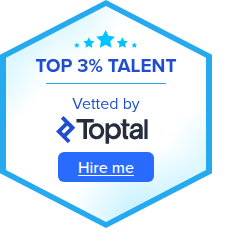

<h1>LOAD "" ⏎</h1>

How it started: tape games, Imagina demos, Wordperfect.

How it's going: quantum compilers, Claude Code.

Open to freelance work via Toptal.

 

## Tech stack

<b>C++</b> &nbsp;          
<b>Python</b> &nbsp;     
<b>Compilation</b> &nbsp;     
<b>DevOps</b> &nbsp;   
<b>AI tools</b> &nbsp; 

## Open-source contributions

<table>

<tr>
<td valign="top">
<b><a href="https://github.com/PennyLaneAI/catalyst">PennyLane / Catalyst</a></b> 
Xanadu's quantum compiler, built on LLVM/MLIR. 

</td>
<td valign="top">
<a href="https://github.com/PennyLaneAI/catalyst/pull/2259">Unify compilation pipelines to a single source of truth</a> · Apr 2026 
<a href="https://github.com/PennyLaneAI/catalyst/pull/2331">Comments on Accelerate LAPACKE integration</a> · Apr 2026 
<a href="https://github.com/PennyLaneAI/catalyst/pull/2168">Fix plugin documentation on <code>cl</code> options registration</a> · Nov 2025 
<a href="https://github.com/PennyLaneAI/catalyst/pull/2156">Fix <code>catalyst.qjit</code> and <code>catalyst.CompileOptions</code> docs render</a> · Oct 2025 
<a href="https://github.com/PennyLaneAI/catalyst/pull/1984">Refactor Catalyst pass registering</a> · Oct 2025 
<a href="https://github.com/PennyLaneAI/catalyst/pull/2054">Add variable names to the IR</a> · Oct 2025 
<a href="https://github.com/PennyLaneAI/catalyst/pull/1999">Improve test of <code>merge-ppr-ppm</code> pass</a> · Sep 2025 
<a href="https://github.com/PennyLaneAI/catalyst/pull/1966">Support commuting <code>P(π/2)</code> past non-Clifford PPR</a> · Aug 2025 
<a href="https://github.com/PennyLaneAI/catalyst/pull/1955">Add merge rotation patterns for <code>qml.Rot</code> and <code>qml.CRot</code></a> · Aug 2025 
<a href="https://github.com/PennyLaneAI/catalyst/pull/1922">Display Catalyst version in <code>quantum-opt --version</code> output</a> · Jul 2025
</td>
</tr>

<tr>
<td valign="top">
<b><a href="https://github.com/PennyLaneAI/jeff-mlir">PennyLane / Jeff MLIR</a></b> 
MLIR dialect for <code>jeff</code>, an interchange format for quantum compilers. 

</td>
<td valign="top">
<a href="https://github.com/PennyLaneAI/jeff-mlir/pull/20">Implement parse functions of SCF operations</a> · Jun 2026
</td>
</tr>

<tr>
<td valign="top">
<b><a href="https://github.com/munich-quantum-toolkit/core">Munich Quantum Toolkit / Core</a></b> 
The backbone of the Munich Quantum Toolkit (MQT). 

</td>
<td valign="top">
<a href="https://github.com/munich-quantum-toolkit/core/pull/1956">Extend Layout API for partial injections</a> · Aug 2026 
<a href="https://github.com/munich-quantum-toolkit/core/pull/1926">Fix Qiskit upstream tests failure</a> · Jul 2026 
<a href="https://github.com/munich-quantum-toolkit/core/pull/1877">Add QIR Output Schemas support to the QIR runtime</a> · Jul 2026 
<a href="https://github.com/munich-quantum-toolkit/core/pull/1799">Add non-bit record output functions to the QIR runtime</a> · Jul 2026 
<a href="https://github.com/munich-quantum-toolkit/core/pull/1766">Add QIR program format support to the DDSIM QDMI device</a> · Jun 2026
</td>
</tr>

<tr>
<td valign="top">
<b><a href="https://github.com/llvm/llvm-project">LLVM / LLVM project</a></b> 
Upstream LLVM / Clang. 

</td>
<td valign="top">
<a href="https://github.com/llvm/llvm-project/pull/173197">Add <code>cpuid</code>/<code>cpuidex</code> support for CIR on x86</a> · Jan 2026 
<a href="https://github.com/llvm/llvm-project/pull/166103">Add AVX512 <code>KTEST</code>/<code>KORTEST</code> intrinsics to constexpr evaluation in Clang's <code>VectorExprEvaluator</code></a> · Nov 2025
</td>
</tr>

</table>

## Personal projects

<table>

<tr>
<td valign="top">
<b><a href="https://github.com/rturrado/the_modern_cpp_challenge">The Modern C++ Challenge</a></b> 
100 modern C++ programming problems; including tests, benchmarks, sanitizers, coverage, CI, and Docker delivery. 

</td>
</tr>

<tr>
<td valign="top">
<b><a href="https://github.com/rturrado/coro">Coro</a></b>, <b><a href="https://github.com/rturrado/word_converter">Word converter</a></b> 
Examples using <code>std::generator</code> proposal and <code>boost::asio</code> coroutines; and a coroutine-based tokenizer. 

</td>
</tr>

<tr>
<td valign="top">
<b><a href="https://github.com/rturrado/aoc_2022">Advent of Code 2022</a></b>, <b><a href="https://github.com/rturrado/knecht4">Knecht4</a></b>, <b><a href="https://github.com/rturrado/zorita">Zorita</a></b> 
Christmas (and elves) -themed programming puzzles, a Connect 4 game, and a RISC machine implementation. 

</td>
</tr>

<tr>
<td valign="top">
<b><a href="https://github.com/rturrado/arkanoid">Arkanoid</a></b> 
Ye olde arcade game. 

</td>
</tr>

</table>

## Stats

  
  

